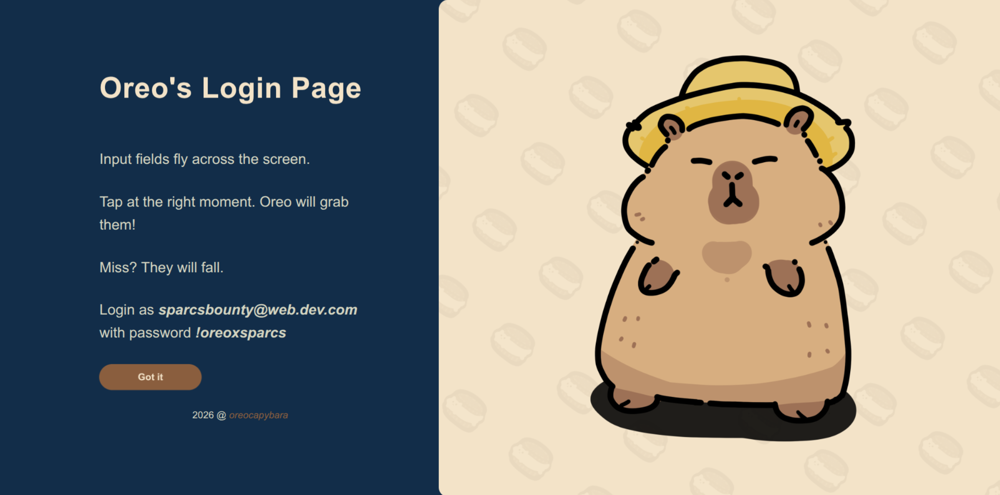
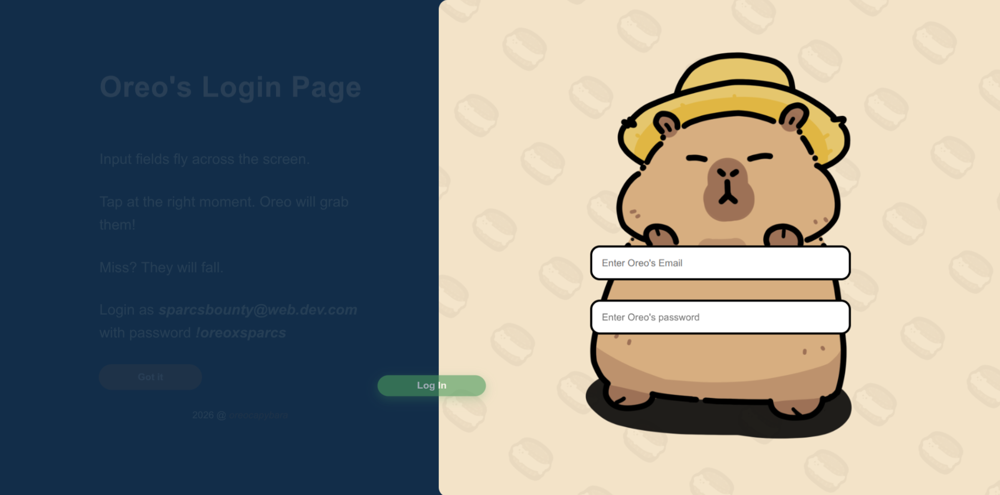
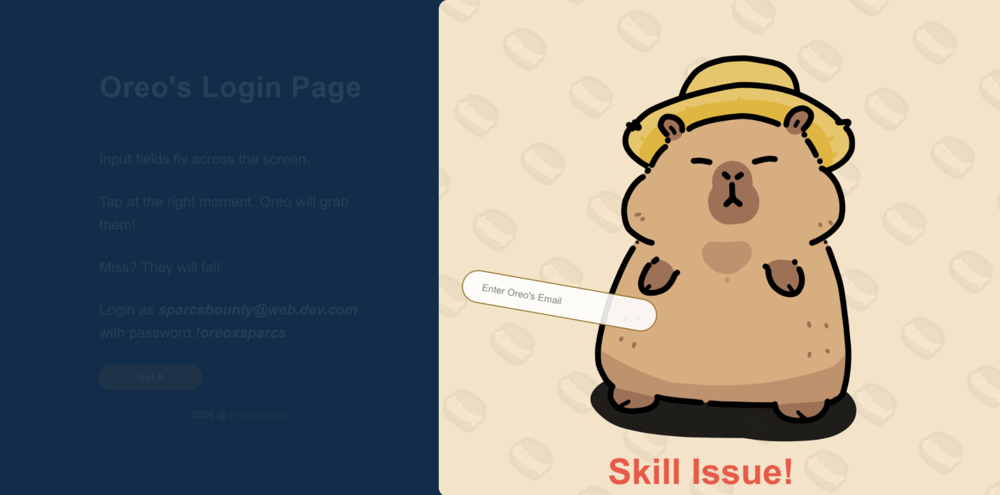

# Oreo's Login Page
An unpractical approach to a creative login page.
A submission for the SPARCS bounty.

Tap the screen at the right moment so Oreo can grab the input element.






# Features
- **Moving Input Elements** — email, password, and submit phases
- **Capybara character** with entrance and grab animations
- **Sound effects & BGM**

# Folder Structure
```
worst-login-page
├── src
│   ├── assets/
│   │   └── sound/
│   ├── css/
│   ├── js/
│   └── template.html
├── webpack.config.cjs
├── package.json
└── README.md
```

# Stack
- **HTML**
- **JS** (ES Modules)
- **CSS**
- **Webpack 5** (bundler)

# Prerequisites
- **Node.js** (v16+)
- **npm**

# Scripts
- `npm run dev` — starts webpack-dev-server on port 3000
- `npm run build` — builds production bundle to `dist/`
- `npm run deploy` — builds and deploys to GitHub Pages
